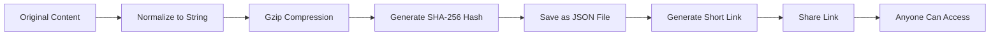

# git-page-link-create

> Create permanent links for HTML, Markdown, and CSV/XLS content using a static Next.js app.

[](https://opensource.org/licenses/MIT)
[](https://nextjs.org/)
[](https://www.typescriptlang.org/)

## Overview

**git-page-link-create** turns content into static JSON files and generates short links to render them. Everything runs in the browser—no backend required.

## Key features

- Permanent links: `/render/{hash}/` and `/render-all/{hash}/`
- Supports **HTML**, **Markdown**, and **CSV/XLS**
- Secure HTML rendering via sandboxed iframe
- Theme system via JSON
- Internationalization (pt, en, es)
- Compatible with Next.js static export

## How it works (short)

1. Content is normalized to a string.
2. Content is compressed (gzip) and hashed with SHA-256 (8 chars).
3. JSON is saved to `public/data/{hash}.json`.
4. A short render link is generated.

> **Important**: JSON file creation is manual before deploy. Generate the link on `/create`, copy the JSON from the browser console, and save it to `public/data/{hash}.json`.

## Project structure

```
src/
├── pages/
│   ├── _app.tsx
│   ├── _document.tsx
│   ├── index.tsx
│   ├── create.tsx
│   ├── render/
│   │   └── [hash].tsx
│   └── render-all/
│       └── [hash].tsx
└── shared/
    ├── lib/
    │   ├── compression.ts
    │   ├── crypto.ts
    │   ├── download.ts
    │   ├── i18n.tsx
    │   └── theme.ts
    ├── ui/
    └── styles/
```

## Running locally

```bash
npm install
npm run dev
```

Open `http://localhost:3000`.

### Useful scripts

```bash
npm run dev
npm run build
npm run export
npm run lint
npm run type-check
```

## GitHub Pages deployment (short)

1. Set `basePath` and `assetPrefix` in `next.config.js`.
2. Run `npm run build` and `npm run export`.
3. Publish the `out/` folder to the `gh-pages` branch.

## Themes

Themes live in `public/layouts/templates/`. The catalog is defined in `public/layouts/layoutsConfig.json`.

## Internationalization

Translations live in `public/locales/{lang}.json`. Update `getAvailableLocales()` in `src/shared/lib/i18n.tsx` when adding languages.

## License

MIT — see `LICENSE`.
# git-page-link-create

> Crie links permanentes para conteúdos HTML, Markdown e CSV/XLS usando um app Next.js estático.

[](https://opensource.org/licenses/MIT)
[](https://nextjs.org/)
[](https://www.typescriptlang.org/)

## Visão geral

O **git-page-link-create** transforma conteúdos em arquivos JSON estáticos e gera links curtos para renderização. Tudo acontece no navegador, sem backend.

## Principais recursos

- Links permanentes no formato `/render/{hash}/` e `/render-all/{hash}/`
- Suporte a **HTML**, **Markdown** e **CSV/XLS**
- Renderização segura de HTML em iframe com sandbox
- Temas configuráveis via JSON
- Interface internacionalizada (pt, en, es)
- Compatível com exportação estática do Next.js

## Como funciona (resumo)

1. O conteúdo é convertido para string.
2. O conteúdo é comprimido (gzip) e recebe um hash SHA-256 (8 caracteres).
3. O JSON é salvo em `public/data/{hash}.json`.
4. O link curto aponta para a página de renderização.

> **Importante**: a criação do arquivo JSON é manual antes do deploy. Gere o link no `/create`, copie o JSON exibido no console e salve em `public/data/{hash}.json`.

## Estrutura do projeto

```
src/
├── pages/
│   ├── _app.tsx
│   ├── _document.tsx
│   ├── index.tsx
│   ├── create.tsx
│   ├── render/
│   │   └── [hash].tsx
│   └── render-all/
│       └── [hash].tsx
└── shared/
    ├── lib/
    │   ├── compression.ts
    │   ├── crypto.ts
    │   ├── download.ts
    │   ├── i18n.tsx
    │   └── theme.ts
    ├── ui/
    └── styles/
```

## Rodando localmente

```bash
npm install
npm run dev
```

Abra `http://localhost:3000`.

### Scripts úteis

```bash
npm run dev
npm run build
npm run export
npm run lint
npm run type-check
```

## Deploy no GitHub Pages (resumo)

1. Ajuste `basePath` e `assetPrefix` em `next.config.js`.
2. Faça `npm run build` e `npm run export`.
3. Publique o conteúdo da pasta `out/` na branch `gh-pages`.

## Temas

Os temas ficam em `public/layouts/templates/`. O catálogo é definido em `public/layouts/layoutsConfig.json`.

## Internacionalização

Traduções em `public/locales/{lang}.json`. Atualize `getAvailableLocales()` em `src/shared/lib/i18n.tsx` para novos idiomas.

## Licença

MIT — veja `LICENSE`.
# git-page-link-create

> Transform HTML, Markdown, and CSV content into permanent, shareable links

[](https://opensource.org/licenses/MIT)
[](https://nextjs.org/)
[](https://www.typescriptlang.org/)

## 📋 Table of Contents

1. [Overview](#-overview)
2. [Problem It Solves](#-problem-it-solves)
3. [How It Works](#-how-it-works)
4. [Supported File Types](#-supported-file-types)
5. [Recommended Limits](#-recommended-limits)
6. [Security](#-security)
7. [Theme System](#-theme-system)
8. [Contributing New Themes](#-contributing-new-themes)
9. [FSD Architecture](#-fsd-architecture)
10. [Tech Stack](#-tech-stack)
11. [Running Locally](#-running-locally)
12. [GitHub Pages Deployment](#-github-pages-deployment)
13. [Use as Portfolio](#-use-as-portfolio)
14. [Internationalization](#-internationalization)
15. [Known Limitations](#-known-limitations)
16. [Future Roadmap](#-future-roadmap)
17. [Credits](#-credits)
18. [License](#-license)

## 🎯 Overview

**git-page-link-create** is a static Next.js application that allows you to create permanent, shareable links for HTML, Markdown, and CSV/XLS content. Your content is compressed, stored as static JSON files, and accessible from any computer without requiring a backend server.

Perfect for:
- 📁 **Portfolio showcases** - Share your projects with permanent links
- 🎨 **Design presentations** - Showcase HTML/CSS work
- 📊 **Data sharing** - Share CSV data as interactive tables
- 📝 **Documentation** - Distribute Markdown docs with permanent URLs

## 🔧 Problem It Solves

Traditional content sharing has limitations:
- ❌ URLs with embedded content become too long
- ❌ Temporary hosting services expire
- ❌ Backend servers require maintenance
- ❌ Content can be lost or modified

**Our solution:**
- ✅ Short, permanent links (e.g., `/render/ab92f1c3/`)
- ✅ Content persisted as static JSON files
- ✅ No backend required - fully static
- ✅ Works on GitHub Pages for free
- ✅ Content accessible from any computer

## ⚙️ How It Works



### The Process:

1. **Input**: Paste or upload your content (HTML/MD/CSV)
2. **Compression**: Content is compressed using gzip (browser-safe)
3. **Hashing**: SHA-256 hash generates a unique 8-character ID
4. **Persistence**: Content saved as `public/data/{hash}.json`
5. **Link Generation**: Short URL created: `/render/{hash}/`
6. **Deployment**: Push to GitHub Pages for permanent hosting

## 📄 Supported File Types

### HTML
- **Description**: Complete web pages rendered securely
- **Rendering**: Isolated iframe with sandbox security
- **Use Cases**: Portfolios, landing pages, interactive demos

### Markdown
- **Description**: Formatted documents converted to HTML
- **Rendering**: Parsed with `marked` library
- **Use Cases**: Documentation, blog posts, README files

### CSV / XLS
- **Description**: Spreadsheets converted to interactive tables
- **Rendering**: Parsed with `papaparse` and `xlsx`
- **Use Cases**: Data tables, reports, analytics

## 📦 Recommended Limits

For optimal user experience:

| Type | Ideal Size | Maximum | Notes |
|------|-----------|---------|-------|
| HTML | 200-300 KB | ~500 KB | Larger files increase load time |
| Markdown | 100-200 KB | ~300 KB | Images should be external links |
| CSV/XLS | 100-150 KB | ~200 KB | Large tables may impact rendering |

> **Note**: Larger files will work but may generate heavier links and impact loading performance.

## 🔒 Security

### HTML Rendering
- **Iframe Sandbox**: All HTML is rendered in sandboxed iframes
- **Attributes**: `sandbox="allow-scripts allow-same-origin"`
- **Isolation**: No access to parent page or cookies
- **XSS Protection**: Content cannot execute malicious code in main context

### Content Storage
- **Static Files**: All content stored as static JSON
- **No Database**: No SQL injection or database vulnerabilities
- **Read-Only**: Content cannot be modified after creation
- **Client-Side**: All processing happens in the browser

## 🎨 Theme System

The application supports multiple visual themes with **light and dark mode variants**.

### Available Themes

#### Matrix (Dark & Light)
The Matrix theme comes in two variants:

**Matrix Dark** (Default):
- 🟢 Neon green primary color (`#00ff41`)
- ⚫ Dark background (`#0d0208`)
- 💻 Monospace font (Courier New)
- ✨ Glow effects on interactive elements
- 🎭 Cyberpunk aesthetic

**Matrix Light**:
- 🟢 Dark green primary color (`#008f11`)
- ⚪ Light background (`#f0f8f0`)
- 💻 Monospace font (Courier New)
- ✨ Subtle glow effects
- 🌿 Clean Matrix-inspired aesthetic

#### Default Theme
A clean, minimal theme perfect for professional use:
- 🔵 Blue primary color (`#0070f3`)
- ⚪ White background
- 📝 System fonts
- 🎯 No special effects
- 💼 Professional look

### Light/Dark Mode Support

Themes can support both light and dark modes using the `supportsLightAndDarkModes` property:

- **`true`**: Theme has both light and dark variants (e.g., Matrix)
- **`false`**: Theme is fixed to one mode (e.g., Default)

### Theme Structure

Themes are defined in `public/layouts/templates/{theme-id}.json`:

```json
{
  "id": "matrix-dark",
  "name": "Matrix Dark",
  "author": "Kauan Vidigal",
  "version": "1.0.0",
  "mode": "dark",
  "supportsLightAndDarkModes": true,
  "colors": {
    "background": "#0d0208",
    "primary": "#00ff41",
    "secondary": "#008f11",
    "text": "#00ff41",
    "textSecondary": "#008f11",
    "cardBackground": "rgba(0, 255, 65, 0.05)",
    "cardBorder": "#00ff41",
    "error": "#ff0000",
    "success": "#00ff41"
  },
  "typography": {
    "fontFamily": "'Courier New', monospace",
    "fontSize": {
      "small": "0.875rem",
      "base": "1rem",
      "medium": "1.125rem",
      "large": "1.25rem",
      "xlarge": "2rem"
    }
  },
  "components": {
    "header": {
      "height": "80px",
      "backgroundColor": "rgba(0, 255, 65, 0.1)",
      "borderBottom": "2px solid #00ff41"
    },
    "footer": {
      "height": "60px",
      "backgroundColor": "rgba(0, 255, 65, 0.05)",
      "borderTop": "1px solid #00ff41"
    },
    "card": {
      "borderRadius": "8px",
      "padding": "24px",
      "boxShadow": "0 0 20px rgba(0, 255, 65, 0.3)"
    },
    "button": {
      "borderRadius": "4px",
      "padding": "12px 24px",
      "border": "2px solid #00ff41",
      "hoverGlow": "0 0 10px #00ff41"
    }
  },
  "animations": {
    "enableTypingEffect": true,
    "enableGlow": true,
    "transitionDuration": "0.3s"
  }
}
```

### Theme Properties

| Property | Type | Description |
|----------|------|-------------|
| `id` | string | Unique theme identifier |
| `name` | string | Display name |
| `author` | string | Theme creator |
| `version` | string | Theme version |
| `mode` | `"light"` \| `"dark"` | Color scheme mode |
| `supportsLightAndDarkModes` | boolean | Whether theme has light/dark variants |
| `colors` | object | Color palette |
| `typography` | object | Font settings |
| `components` | object | Component-specific styles |
| `animations` | object | Animation preferences |

## 🎨 Contributing New Themes

We welcome community-contributed themes! Here's how to create and submit your own.

### Step 1: Create Your Theme JSON

1. Clone the repository:
```bash
git clone https://github.com/Vidigal-code/git-page-link-create.git
cd git-page-link-create
```

2. Create a new theme file in `public/layouts/templates/`:
```bash
# Example: Cyberpunk theme
touch public/layouts/templates/cyberpunk.json
```

3. Define your theme using the Matrix theme as a template:
```json
{
  "id": "cyberpunk",
  "name": "Cyberpunk 2077",
  "author": "Your Name",
  "version": "1.0.0",
  "mode": "dark",
  "supportsLightAndDarkModes": false,
  "colors": {
    "background": "#0a0e27",
    "primary": "#ff2a6d",
    "secondary": "#05d9e8",
    "text": "#d1f7ff",
    "textSecondary": "#05d9e8",
    "cardBackground": "rgba(255, 42, 109, 0.05)",
    "cardBorder": "#ff2a6d",
    "error": "#ff0000",
    "success": "#00ff00"
  },
  "typography": {
    "fontFamily": "'Orbitron', sans-serif",
    "fontSize": {
      "small": "0.875rem",
      "base": "1rem",
      "medium": "1.125rem",
      "large": "1.25rem",
      "xlarge": "2rem"
    }
  },
  "components": {
    "header": {
      "height": "80px",
      "backgroundColor": "rgba(255, 42, 109, 0.1)",
      "borderBottom": "2px solid #ff2a6d"
    },
    "footer": {
      "height": "60px",
      "backgroundColor": "rgba(5, 217, 232, 0.05)",
      "borderTop": "1px solid #05d9e8"
    },
    "card": {
      "borderRadius": "8px",
      "padding": "24px",
      "boxShadow": "0 0 20px rgba(255, 42, 109, 0.3)"
    },
    "button": {
      "borderRadius": "4px",
      "padding": "12px 24px",
      "border": "2px solid #ff2a6d",
      "hoverGlow": "0 0 10px #ff2a6d"
    }
  },
  "animations": {
    "enableTypingEffect": true,
    "enableGlow": true,
    "transitionDuration": "0.3s"
  }
}
```

> **Note**: If creating a theme with both light and dark variants, set `supportsLightAndDarkModes: true` and create two separate files (e.g., `cyberpunk-dark.json` and `cyberpunk-light.json`).

### Step 2: Register Your Theme

Add your theme to `public/layouts/layoutsConfig.json`:

```json
{
  "layouts": [
    {
      "id": "matrix",
      "name": "Matrix Theme",
      "author": "Kauan Vidigal",
      "file": "templates/matrix.json",
      "preview": "Dark theme with neon green accents inspired by The Matrix"
    },
    {
      "id": "cyberpunk",
      "name": "Cyberpunk 2077",
      "author": "Your Name",
      "file": "templates/cyberpunk.json",
      "preview": "Futuristic theme with pink and cyan neon colors"
    }
  ],
  "default": "matrix"
}
```

### Step 3: Test Your Theme

```bash
npm install
npm run dev
```

Open http://localhost:3000 and select your theme from the theme dropdown.

### Step 4: Contribution Checklist

Before submitting a Pull Request, ensure:

- [ ] JSON is valid (use a JSON validator)
- [ ] Color contrast meets WCAG AA standards
- [ ] Theme tested on mobile and desktop
- [ ] Theme ID is unique (doesn't conflict with existing themes)
- [ ] Author and version fields are filled
- [ ] Screenshot included in PR description
- [ ] All pages (Home, Create, Render) look good
- [ ] Text is readable on all backgrounds
- [ ] Buttons and links are easily clickable

### Step 5: Submit Pull Request

```bash
git checkout -b theme/cyberpunk
git add public/layouts/templates/cyberpunk.json public/layouts/layoutsConfig.json
git commit -m "Add Cyberpunk 2077 theme"
git push origin theme/cyberpunk
```

Then open a Pull Request on GitHub with:
- Theme name and description
- Screenshot of the theme
- Any special fonts or resources needed

### Design Guidelines

When creating themes, follow these principles:

1. **Readability First**: Ensure text is always readable
2. **Contrast**: Maintain sufficient contrast between text and background
3. **Consistency**: Use consistent spacing and sizing
4. **Accessibility**: Test with screen readers and keyboard navigation
5. **Performance**: Avoid heavy animations that impact performance
6. **Respect Credits**: Keep the footer credits intact

## 🏗️ FSD Architecture

This project follows **Feature-Sliced Design** (FSD) for scalable architecture:

```
src/
├── pages/              # Next.js routing
│   ├── _app.tsx       # App wrapper
│   ├── _document.tsx  # SSR document
│   ├── index.tsx      # Home page
│   ├── create.tsx     # Create page
│   ├── render/
│   │   └── [hash].tsx # Render page
│   └── render-all/
│       └── [hash].tsx # Full-width render page
├── shared/            # Shared resources
│   ├── lib/          # Utilities
│   │   ├── compression.ts
│   │   ├── crypto.ts
│   │   ├── download.ts
│   │   ├── i18n.tsx
│   │   └── theme.ts
│   ├── ui/           # UI components
│   │   ├── Button/
│   │   ├── Card/
│   │   ├── Input/
│   │   ├── Select/
│   │   ├── Header/
│   │   ├── Footer/
│   │   └── Layout/
│   └── styles/       # Global styles
│       ├── GlobalStyle.ts
│       └── theme.d.ts
```

### Layer Responsibilities

- **Pages**: Routing and page composition
- **Shared**: Reusable utilities and components

## 🛠️ Tech Stack

### Core
- **Next.js 14** - React framework with static export
- **TypeScript 5.3** - Type safety
- **React 18** - UI library

### Styling
- **styled-components 6** - CSS-in-JS with theming
- **SSR Support** - Server-side rendering for styles

### Content Processing
- **pako** - Gzip compression/decompression
- **marked** - Markdown to HTML conversion
- **papaparse** - CSV parsing
- **xlsx** - Excel file parsing

### Security
- **Web Crypto API** - SHA-256 hashing
- **Iframe Sandbox** - Secure HTML rendering

## 🚀 Running Locally

### Prerequisites
- Node.js 18+ and npm

### Installation

```bash
# Clone the repository
git clone https://github.com/Vidigal-code/git-page-link-create.git
cd git-page-link-create

# Install dependencies
npm install

# Run development server
npm run dev
```

Open [http://localhost:3000](http://localhost:3000) in your browser.

### Available Scripts

```bash
npm run dev        # Start development server
npm run build      # Build for production
npm run export     # Export static site
npm run deploy     # Build and export
npm run lint       # Run ESLint
npm run type-check # Run TypeScript compiler
```

## 🌐 GitHub Pages Deployment

### Step 1: Configure Base Path

Edit `next.config.js`:

```javascript
const nextConfig = {
  output: 'export',
  basePath: '/git-page-link-create',  // Your repo name
  assetPrefix: '/git-page-link-create/',
  trailingSlash: true,
  // ... rest of config
}
```

### Step 2: Build and Export

```bash
npm run build
npm run export
```

This creates an `out/` directory with your static site.

### Step 3: Deploy to GitHub Pages

#### Option A: Manual Deployment

```bash
# Create .nojekyll file
touch out/.nojekyll

# Push to gh-pages branch
git checkout --orphan gh-pages
git --work-tree out add --all
git --work-tree out commit -m 'Deploy to GitHub Pages'
git push origin HEAD:gh-pages --force
git checkout main
```

#### Option B: GitHub Actions (Automated)

Create `.github/workflows/deploy.yml`:

```yaml
name: Deploy to GitHub Pages

on:
  push:
    branches: [main]

jobs:
  deploy:
    runs-on: ubuntu-latest
    steps:
      - uses: actions/checkout@v3
      
      - name: Setup Node.js
        uses: actions/setup-node@v3
        with:
          node-version: '18'
          
      - name: Install dependencies
        run: npm ci
        
      - name: Build
        run: npm run build && npm run export
        
      - name: Deploy
        uses: peaceiris/actions-gh-pages@v3
        with:
          github_token: ${{ secrets.GITHUB_TOKEN }}
          publish_dir: ./out
```

### Step 4: Enable GitHub Pages

1. Go to repository **Settings**
2. Navigate to **Pages**
3. Set source to `gh-pages` branch
4. Save

Your site will be available at: `https://username.github.io/git-page-link-create/`

### Important: Manual JSON Creation

> **⚠️ Critical**: When you generate a link on the `/create` page, the JSON file is NOT automatically created. You must manually create it in `public/data/{hash}.json` before deploying.

**Workflow:**
1. Generate link on `/create` page
2. Copy the JSON from browser console
3. Create file `public/data/{hash}.json` with that content
4. Commit and push
5. Redeploy to GitHub Pages

## 💼 Use as Portfolio

This project is perfect for showcasing your work:

### Example Use Cases

1. **Web Developer Portfolio**
   - Create HTML pages for each project
   - Generate permanent links
   - Share on resume/LinkedIn

2. **Designer Showcase**
   - Upload design mockups as HTML
   - Create interactive prototypes
   - Share with clients

3. **Data Analyst Portfolio**
   - Share CSV data visualizations
   - Create interactive tables
   - Demonstrate data skills

### Portfolio Tips

- Use descriptive filenames when downloading
- Organize content by project type
- Keep file sizes under recommended limits
- Test on multiple devices before sharing

## 🌍 Internationalization

The app supports three languages:

- 🇧🇷 **Portuguese** (pt) - Default
- 🇺🇸 **English** (en)
- 🇪🇸 **Spanish** (es)

### Adding New Languages

1. Create translation file in `public/locales/{lang}.json`
2. Update `getAvailableLocales()` in `src/shared/lib/i18n.tsx`
3. Add language option to header selector

Translation files follow this structure:

```json
{
  "common": { "appName": "...", "language": "..." },
  "home": { "title": "...", "subtitle": "..." },
  "create": { "title": "...", "generateLink": "..." },
  "render": { "title": "...", "downloadOriginal": "..." },
  "footer": { "createdBy": "...", "github": "..." }
}
```

## ⚠️ Known Limitations

1. **Manual JSON Creation**: Content JSON files must be manually created for deployment
2. **File Size**: Very large files (>1MB) may cause performance issues
3. **Static Only**: No dynamic content or real-time updates
4. **Browser Support**: Requires modern browsers with Web Crypto API
5. **No Search**: No built-in search functionality for content
6. **No Analytics**: No built-in usage tracking

## 🗺️ Future Roadmap

- [ ] Automated JSON file generation during build
- [ ] Content search functionality
- [ ] More default themes (Dracula, Nord, Solarized)
- [ ] PDF support
- [ ] Image optimization
- [ ] Content versioning
- [ ] Analytics integration
- [ ] PWA support
- [ ] Dark/Light mode toggle per theme
- [ ] Custom domain support guide

## 👨‍💻 Credits

Developed by **Kauan Vidigal**

- GitHub: [@Vidigal-code](https://github.com/Vidigal-code)
- Project: [git-page-link-create](https://github.com/Vidigal-code/git-page-link-create)

### Special Thanks

- Next.js team for the amazing framework
- styled-components for the theming system
- Open source community for the libraries used

---

**If this project was useful to you, consider giving it a ⭐ on GitHub!**

## 📄 License

This project is licensed under the **MIT License** - see the [LICENSE](LICENSE) file for details.

---

Made with 💚 by [Kauan Vidigal](https://github.com/Vidigal-code)
